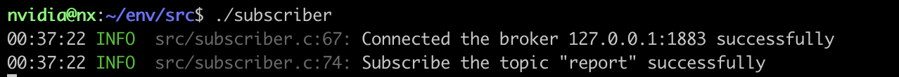
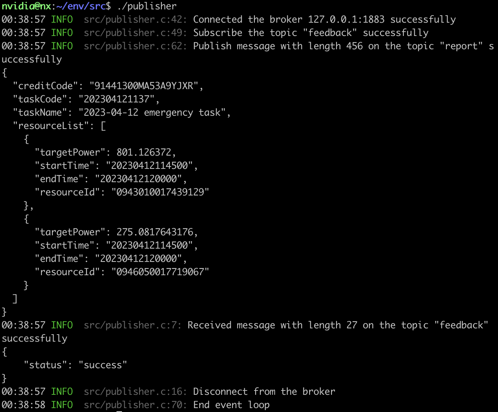
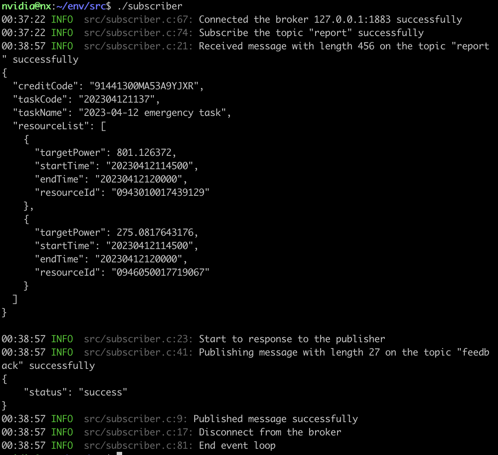

# 介绍
本项目在模拟终端设备(MQTT发布者)和主站(MQTT订阅者)之间实现了MQTT协议的通信过程。

其中，模拟终端设备充当MQTT发布者，报告收集到的数据。主站充当MQTT订阅者，订阅这条消息的主题。主站在成功收到模拟终端设备报告的数据后，主站会发布消息通知模拟终端设备。

# 代码组织
```
├── data
│   ├── intraday.json
│   ├── invitation.json
│   ├── prior.json
│   └── response.json
├── include
│   ├── common.h
│   └── log.h
├── lib
│   ├── liblog.so -> liblog.so.1
│   ├── liblog.so.1
│   ├── libmosquitto.so -> libmosquitto.so.1
│   └── libmosquitto.so.1
├── Makefile
├── README.md
├── README_zh.md
└── src
    ├── log/
    ├── mosquitto/
    ├── Makefile
    ├── publisher.c
    ├── subscriber.c
    ├── publisher
    └── subscriber
```
|目录|作用|解释|
|--|--|--|
|`.vscode`|vscode配置文件|`tasks.json`：项目的构建配置，可以通过`Ctrl-shift-B`直接构建；`launch.json`：项目的调试配置；`settings.json`：vsocde的首选项配置|
|`data`|数据文件|`intraday.json, invitation.json, prior.json`：模拟终端设备的收集到的数据；`response.json`：主站返回给模拟终端设备的消息|
|`include`|头文件|`common.h`：MQTT发布者和MQTT订阅者共用的头文件；`log.h`：log日志库的头文件；`mosquitto.h`：mosquitto库的文件|
|`lib`|库文件|`liblog.so`：用于编译的log日志动态库；`libmosquitto.so`：编译后的mosquitto动态库；`liblog.so.1`：用于运行的log日志动态库；`libmosquitto.so.1`：用于运行的mosquitto动态库|
|`src`|源文件|`log/`：log日志库源代码；`mosquitto/`：mosquitto库源代码；`publisher.c`：MQTT发布者(模拟终端设备)的源代码；`subscriber.c`：MQTT订阅者(主站)的源代码；`publisher`：MQTT发布者(模拟终端设备)的可执行文件；`subscriber.c`：MQTT订阅者(主站)的可执行文件|
|`Makefile`|编译规则|定义了通过`make`命令编译`publisher, subscriber`的构建规则|

# 安装依赖
1. 安装并启动MQTT代理（MQTT代理通常由云平台实现，因此在本项目中未实现）
```
sudo apt install mosquitto
```
2. 安装本代码依赖的`openssl/opensslconf.h`的头文件，通常该文件在大部分linux内置，如果缺少该文件，执行下面的命令安装
```
sudo apt install libssl-dev
```
3. 开始编译项目，生成用于模拟终端的`publisher`和用于主站的`subscriber`
```
make
```
4. 首先运行主站(MQTT订阅者)
```
cd src
./subscriber
```
5. 然后运行模拟终端(MQTT订阅者)
```
./publisher
```

# 运行结果
1. 首先运行主站。可以看到主站作为一个MQTT订阅者成功连接到了云平台的MQTT代理，并订阅了`report`主题。模拟终端设备会将自己收集到的数据上报到该主题。


2. 然后运行模拟终端设备。可以看到模拟终端作为一个MQTT发布者成功连接到了云平台的MQTT代理，并订阅了`feedback`主题。主站在成功收到模拟终端设备上报的数据后会发布通知到该主题。之后，模拟终端发布了456字节的JSON数据，其中包含了终端设备的日前计划参数。发布成功后，模拟终端立即收到了来自主站的通知，该消息通告模拟终端自己已经成功收到了之前上报的日前计划参数。在完成一轮通信后，模拟终端关闭连接并正常退出。


3. 切换到主站侧。可以看到模拟终端发布了日前计划参数后，主站立即收到了该消息，然后发布了一个成功收到的消息到`feedback`主题，然后关闭连接并正常退出。
